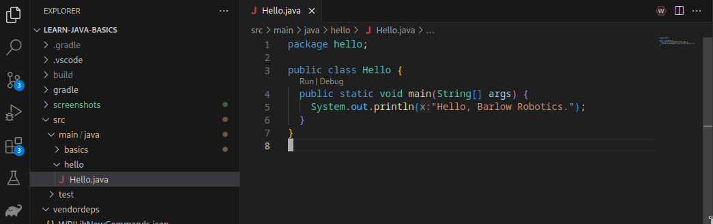

# Learn-java-basics

The module is designed to establish a baseline of java competency necessary for
writing java code as part of our codebase. It aims to ensure that you are set up
and able to use our tools, as well as that you are familiar enough with the
basics of java to begin contributing to the codebase.

This module is not a substitute for taking a real java course with a more
comprehensive java curriculum. If you have never programmed or worked with
java before, talk to one of the mentors about finding a java curriculum
that's right for you.

## Assumptions & prerequisites
- You should have already completed the
[learn-to-learn](https://github.com/Barlow-Robotics/learn-to-learn) module.
  - You should have VS Code installed.
  - You should be comfortable creating a branch and submitting a pull request.
- You should know enough java that you have a basic understanding of these concepts:
  - Primitive/scalar Data types (int, double, string, etc.)
  - Classes and constructors
  - Member variables
  - Member functions and parameters
  - Assignments and expressions
  - If-then-else
  - Looping

## Objectives and motivation
- Add additional java-specific extensions to VS Code.
  - These tools will enhance your abillity to quickly write correct code.
- Modify some simple java programs so that they function correctly.
  - Modifying this code is a good way for you to gauge how comfortable you are
    with java development.
- Learn how to run unit tests.
  - Unit tests allow us to verify parts of our code are correct before we
  commit it to the `main` branch or deploy it to the robot.
- Learn how to check your code for basic formatting issues using `spotless`
  - Formatting code consistently reduces the need to resolbe unnecessary merge
  conflicts due to whitespace changes.

## Demonstration of competency

To complete this module you should:
- Install the following VS Code extensions:
  - Microsoft "Extension Pack for Java"
  - "Spotless Gradle"
- Configure spotless to format your files on java.
- Modify all of the files in [src/main/java/basics](src/main/java/basics/) so that they work.
- Submit a Pull Request to this repostiroy with the changed files.

# Resources

## Barlow-developed resources
- Video Walkthrough
  - TODO: We should record a short video walkthrough of installing the VS Code Extensions,
  running the units tests, and running spotless.

## VS Code Extensions
- [Installing extensions](https://code.visualstudio.com/docs/editor/extension-marketplace)
- [Extension Pack for Java](https://marketplace.visualstudio.com/items?itemName=vscjava.vscode-java-pack)
- [Spotless Gradle](https://marketplace.visualstudio.com/items?itemName=richardwillis.vscode-spotless-gradle)

## Introductory Java Resources
- [Code Academy](https://www.codecademy.com/learn/learn-java)
- [W3 Schools](https://www.w3schools.com/java)

# More detailed steps

Start by cloning this repository and opening it in VS Code

## Installing and Configuring the VS Code extenions

If you're not yet familiar with installing extensions in VS Code see the explanation here:
- [Installing extensions](https://code.visualstudio.com/docs/editor/extension-marketplace)

Now, open the extension tab in the activity bar and search for / install the two extensions:
- [Installing extensions](https://code.visualstudio.com/docs/editor/extension-marketplace)
- [Extension Pack for Java](https://marketplace.visualstudio.com/items?itemName=vscjava.vscode-java-pack)

Now we should configure spotless to run on save. There are two ways to configure
settings in VS Code.

To use the UI:
- Go to "File -> Preferences -> Settings"
- Search for "Default Formatter"
  - Change the value to "Spotless Gradle"
- Search for "Spotless Gradle Format"
  - Check the box to enable formatting
- Search for "Format on Save"
  - Check the box to enable formatting on save

To edit the preferences directly:
- Open the command palette with `ctrl-alt-p`
- Type: "Settings User JSON"
  - Select the open: "Preferences: Open User Settings (JSON)
  - Copy the following 3 lines into the settings JSON file
  ```json
  "editor.defaultFormatter": "richardwillis.vscode-spotless-gradle"
  "spotlessGradle.format.enable": true,
  "editor.formatOnSave": true,
  ```

## Verify you can work with `java` program

Open the file: `src/main/java/hello/Hello.java`

If everything is configured correctly, the file should look like:


If you click the button that says `Run`, VS Code should open a terminal
that executes the program for you and prints out:
```
Hello, Barlow Robotics.
```

While you're here, you should make sure that Spotless is set up correctly.
Modify this file by messing with the whitespace and indentation such as:
```java
package hello;

public class Hello {

  public static void main(String[] args)
  {
    System.out.println("Hello, Barlow Robotics.");
}


 }
```
when you save the file, the formatting should be fixed for you automatically.

## Verify your java knowledge

In the folder `src/main/java/basics` you will find a series of classes. Go
ahead and open the first one `Learn_01_Types.java`.

If your java tools are configured correctly, you should see several lines in
the file that have red underlines beneath them.

TODO: Add another screenshot

Fix all the problems in the file so that you can run the program.

Before you continue through the remaining `.java` files in the folder,
this is a good time to create a new branch so you can commit your changes
and maintain your progress.

TODO: Finish populating different sections.

## Run the unit-test suite

The main programs included in each of the `.java` files allowed you to verify
that the program compiled and run, but not that the code was actually correct.

This project also has a unit-test framework set up. You can find the
corresponding tests in the `src/test/java` folder instead.

You can run the set of unit tests for the project using the command pallette:
`ctrl-alt-p -> WPILib: Test Robot Code -> java`

The output terminal should let you know which, if any, tests are failing, and
on which line-number the failure occured. Correct any remaining problems until
the terminal shows a successful result such as:
```
BUILD SUCCESSFUL in 525ms
3 actionable tasks: 3 executed
```
## Submit your changes

When all java modules are building and the unit tests are passing, make sure to
commit any final changes you have made. Now create a Pull Request containing
your changes and submit it to the
